# Библиотека NotesComPy

Библиотека позволяет взаимодействовать с объектами Notes через COM

## Ограничения
Взаимодействие реализовано через COM, поэтому работает только под Windows. Также необходим установленный клиент IBM Lotus Notes (HCL Notes). Подключение идет от имени пользователя, указанного в файле конфигурации Notes (notes.ini). Также возможна работа от текущего залогиненного пользователя.

## Доступные классы
Реализованы следующие основные классы и их методы:
* NotesSession
* NotesDatabase
* NotesDocument
* NotesView
* NotesDocumentCollection
* NotesACL
* NotesACLEntry
* NotesAgent
* NotesLog

Для расширенной работы с коллекциям документов реализован класс CustomCollection, позволяющий работать с документами из разных баз и эмулирующий транзакционное сохранение.
Для большинства классов реализована возможность экспорта данных и другие возможности, изначально отсутствующие в классах Notes.


## Работа с библиотекой
Разберем основный возможности библиотеки на примере работы с простой notes базой IT crowd. База состоит из двух справочников - Levels и  Languages и основной карточки Person.

Справочник языков программирования:
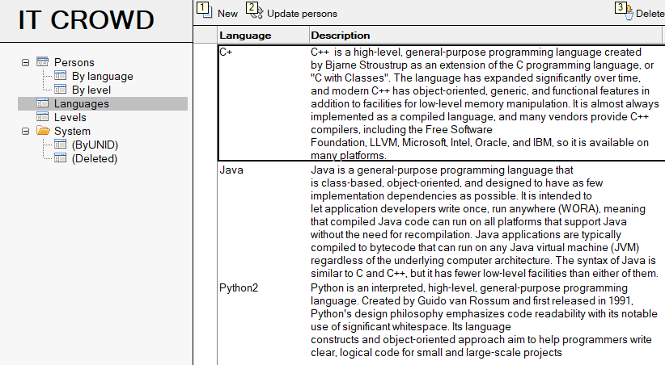

Справочник уровней:
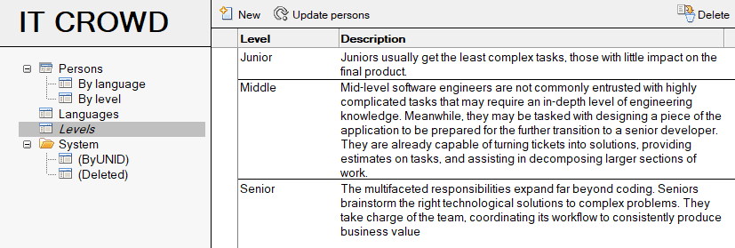

Сотрудники:
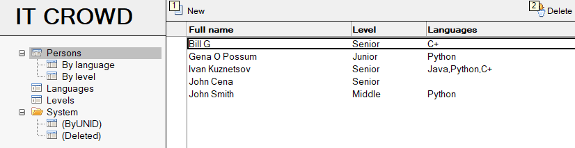

Для сотрудника можно указать ФИО и телефон и выбрать из справочника языки, которыми он владеет и его уровень:
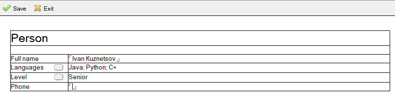

В справочниках есть кнопка **Update person**, запускающая агент, обновляющий в карточках сотрудников измененное название языка или уровня.

#### Инициализация
Прежде всего необходимо проинициализировать сессию, передав в нее пароль от текущего user.id:
```
from notescompy import init_session, open_database
s = session.init_session("python")
```
Можно посмотреть текущего пользователя:

```
print(s.UserName)
```

> CN=Python/O=PyLN

#### Работа с базой
Теперь можно получить базу, передав сервер и путь:
```
db = open_database('PyLN', 'itcrowd.nsf')
```

Посмотрим размер базы и ее название:

```
print(db.title, db.size)
```
> IT Crowd 884736.0

Из базы можно получить коллекцию всех документов, ACL, получить конкретный документ или создать новый, получить представление и агент:
```
all_col = db.all_documents
acl = db.acl
doc = db.get_document_by_unid("9A899214038E229843258541003BFFDB")
new_doc = db.create_document()
view = db.get_view("Levels")
agent = db.get_agent("UpdatePerson")
```
Работу с получившимися объектами разберем в соответствующих разделах.

Также доступен поиск по формуле. Обычно вторым и третьим параметрами мы передаем Nothing и 0, поэтому эти значения заданы по умолчанию, достаточно задать только формулу.

Найдем всех сотрудников, у которых в имени встречается John:

```
col = db.search("@contains(FullName;'John'")
```

#### Документ
Для начала возьмем документ из примера с базой:
```
from notescompy import init_session, open_database
s = init_session("python")
db = open_database('PyLN', 'itcrowd.nsf')
doc = db.get_document_by_unid("9A899214038E229843258541003BFFDB")
```
Посмотрим его форму:
````
print(doc.get_item_value("Form"))
````
> ['Person']

Как вы могли заметить, наименование методов слегка не привычно, в LotusScript мы привыкли к `doc.GetItemValue`, однако это не соответствует требованиям PEP8. Тем не менее реализована возможности обращаться к методам и свойствам с привычными наименованиями.
Посмотрим значение поля Level LotusScript-стиле
```
print(doc.GetItemValue("Level"))
```
> ['Senior']

Как известно, `GetItemValue` возвращает массив значений (список в Python), даже если значение в поле одно и мы постоянно берем от него нулевое значение
```
print(doc.get_item_value("Level")[0])
```
> Senior

Но это же Python, должен быть сахар и это метод `get_item_value0`
```
print(doc.get_item_value0("Level"))
```
> Senior

В обоих случаях возвращается не список, а строка.

Создадим новый документ в сравочнике языков:
```
lang_doc = db.create_document()
lang_doc.replace_item_value("Form", "Language")
lang_doc.replace_item_value("Name", "Go")
lang_doc.replace_item_value("Description", "Go is an open source programming language that makes it easy to build simple, reliable, and efficient software")
```
На форме есть вычисляемое поле UNID, поэтому вызовем метод `compute_with_form`:
```
lang_doc.compute_with_form()
```
и сохраним (обычно мы сохраняем `doc.Save(True, False)`, поэтому эти значения заданы по умолчанию и их можно опустить):
```
lang_doc.save()
```
В базе появился новый документ:
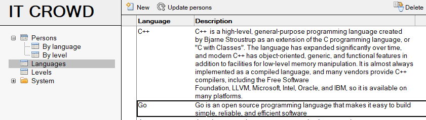


Часто, при получении значений из документа, нужно не одно поле, а сразу несколько, а иногда и какие-то свойства документа или результаты вычисления формул. Для этого можно применить метод `get_values`, который вернет все значения как словарь:

```
values = lang_doc.get_values(["Form", "Name"], "Universalid", "@created", "Дата создания")
print(values)
```
> {'Form': ['Language'], 'Name': ['Go'], 'Universalid': 'C56A8822BD4C0FF54325854C00536CCE', 'Дата создания': [datetime.datetime(2020, 4, 16, 18, 11, 13)]}

А когда нам не нужны списки, можно вернут значения в виде единичных значений, передав параметр `no_list=True`:

```
values = lang_doc.get_values(["Form", "Name"], "Universalid", "@created", "Дата создания", no_list=True)
print(values)
```
> {'Form': 'Language', 'Name': 'Go', 'Universalid': 'C56A8822BD4C0FF54325854C00536CCE', 'Дата создания': datetime.datetime(2020, 4, 16, 18, 11, 13)}

#### Представления
Получим представление с уровнями:
```
from notescompy import init_session, open_database
s = init_session("python")
db = open_database('PyLN', 'itcrowd.nsf')
view = db.get_view("Levels")
```

Проитерируемся по представлению в LS-стиле:
```
doc = view.get_first_document()
while doc:
    print(doc.universal_id)
    doc = view.get_next_document()
```

Также представление поддерживает питоновский протокол итерации:
```
for doc in view:
    print(doc.universal_id)
```

В обоих случая получим униды всех документов в представлении:
> 8C5A8BCE0F3666A84325854100363E5D
38187A89713365CB4325854100363BF7
0FB66AA59EAE2A0B43258541003638ED

Второй из наиболее используемых методов работы с представлением - это отбор документов по ключу. Возьмем представления с сотрудниками, отсортированное по униду уровня, и отберем всех, знающих Python (унид справочника - 3F1B416909DE674043258541003445AA)

```
view = db.get_view("srchPersonsByLanguage")
col = view.get_all_documents_by_key("3F1B416909DE674043258541003445AA")
print(col.count)
```
> 3

Получили коллекцию из трех документов.


Если нам нужны значения всех документов представления в том виде, как они отображаются в представлении, то можно воспользоваться методом `get_values`. Возьмем представление с сотрудниками, значения получим как строки, а для объединения мультизначных полей будет использовать / 
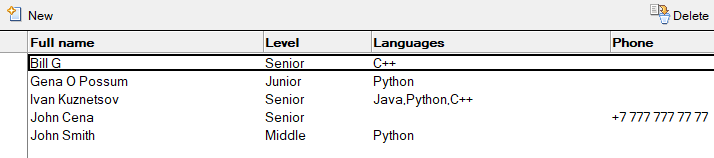
```
view = db.get_view("Persons")
values = view.get_values(no_list=True, sep="/")
print(values)
```
> {'F219AA2C843B6DD743258541003C1E99': {'Full name': 'Bill G', 'Level': 'Senior', 'Languages': 'C++', 'Phone': ''}, 'A5426F32DBE6B94143258541003C40CE': {'Full name': 'Gena O Possum', 'Level': 'Junior', 'Languages': 'Python', 'Phone': ''}, '9A899214038E229843258541003BFFDB': {'Full name': 'Ivan Kuznetsov', 'Level': 'Senior', 'Languages': 'Java/Python/C++', 'Phone': ''}, 'DFBCDDFEE3D0764C432585410046CFFE': {'Full name': 'John Cena', 'Level': 'Senior', 'Languages': '', 'Phone': '+7 777 777 77 77'}, '45A4A1F61B47769443258541003609B3': {'Full name': 'John Smith', 'Level': 'Middle', 'Languages': 'Python', 'Phone': ''}}

#### Коллекции
Продолжим работать с коллекцией, полученной из представления:
```from notescompy import init_session, open_database
s = init_session("python")
db = open_database('PyLN', 'itcrowd.nsf')
view = db.get_view("srchPersonsByLanguage")
col = view.get_all_documents_by_key("3F1B416909DE674043258541003445AA")
```

Итерация поддерживается в LN и в Python стиле:
```
doc = col.GetFirstDocument()
while doc:
    print(doc.universal_id)
    doc = col.GetNextDocument()
```
```
for doc in col:
    print(doc.universal_id)
```

Рассмотрим еще пару способов применения метода `get_values`.

Без параметров:
```
print(col.get_values())
```

В качестве формул передадим представление:
```
print(col.get_values(formulas=persons_view, formulas_names=persons_view))
```

В первом случае получим значение всех полей в документе, за исключением служебных (начинающихся на $) а тажке два основных свойства `UniversalId` и `Created`:
> {'45A4A1F61B47769443258541003609B3': {'levelunid': ['38187A89713365CB4325854100363BF7'], 'languagesunid': ['3F1B416909DE674043258541003445AA'], 'Form': ['Person'], 'UNID': ['45A4A1F61B47769443258541003609B3'], 'FullName': ['John Smith'], 'Languages': ['Python'], 'Level': ['Middle'], 'test1': ['ok'], 'UniversalId': '45A4A1F61B47769443258541003609B3', 'Created': datetime.datetime(2020, 4, 5, 12, 50, 14)}, '9A899214038E229843258541003BFFDB': {'languagesunid': ['8267D1ACBF7A300243258541003552BD', '3F1B416909DE674043258541003445AA', '51AD377698E6CD2F43258541003550D3'], 'levelunid': ['0FB66AA59EAE2A0B43258541003638ED'], 'Form': ['Person'], 'UNID': ['9A899214038E229843258541003BFFDB'], 'FullName': ['Ivan Kuznetsov'], 'Languages': ['Java', 'Python', 'C++'], 'Level': ['Senior'], 'test1': ['ok'], 'UniversalId': '9A899214038E229843258541003BFFDB', 'Created': datetime.datetime(2020, 4, 5, 13, 55, 21)}, 'A5426F32DBE6B94143258541003C40CE': {'languagesunid': ['3F1B416909DE674043258541003445AA'], 'levelunid': ['8C5A8BCE0F3666A84325854100363E5D'], 'test1': ['ok'], 'Form': ['Person'], 'UNID': ['A5426F32DBE6B94143258541003C40CE'], 'FullName': ['Gena O Possum'], 'Phone': [''], 'Languages': ['Python'], 'Level': ['Junior'], 'UniversalId': 'A5426F32DBE6B94143258541003C40CE', 'Created': datetime.datetime(2020, 4, 5, 13, 58, 7)}}

Во втором же из представления будут взяты все формулы колонок и их заголовков и применены к документу:
> {'45A4A1F61B47769443258541003609B3': {'Full name': ['John Smith'], 'Level': ['Middle'], 'Languages': ['Python'], 'Phone': ['']}, '9A899214038E229843258541003BFFDB': {'Full name': ['Ivan Kuznetsov'], 'Level': ['Senior'], 'Languages': ['Java', 'Python', 'C++'], 'Phone': ['']}, 'A5426F32DBE6B94143258541003C40CE': {'Full name': ['Gena O Possum'], 'Level': ['Junior'], 'Languages': ['Python'], 'Phone': ['']}}

#### Расширенная коллекция
NotesDocumentCollection может содержать в себе только документы, полученные из одного объекта базы данных. ExtendedCollection может содержать любые документы, а также позволяет добавлять в себя документы из представлений, коллекций и расширенных коллекций
Соберем коллекцию из всех справочников языков и уровней:

```
from notescompy import init_session, open_database
from notescompy.extended_collection import ExtendedCollection
s = init_session("python")

ext_col = ExtendedCollection()

db = open_database('PyLN', 'itcrowd.nsf')
for doc in db.get_view("Levels"):
    ext_col.append(doc)
```

Уровни мы добавляли по одному, языки добавим все сразу:
```
view = db.get_view("Languages")
ext_col.append(view)
```

Для примера добавим также коллекцию с сотрудниками и посмотрим что содержится в коллекции:
```
other_col = ExtendedCollection(db.get_view("Persons"))
ext_col.append(other_col)

for doc in ext_col:
    print(doc.get_item_value0("Form"))
```
> Level
Level
Level
Language
Language
Language
Language
Language
Person
Person
Person
Person
Person

Удалим ненужных сотрудников, оставив только справочники:

```
ext_col.remove(db.get_view("Persons"))
```

Метод `stamp_all` - в отличии от `NotesDocumentCollection` метод не сохраняет документы, а только лишь заменяет значение поля. 

##### Сохранение расширенной коллекции

После всех изменений необходимо сохранить расширенную коллекцию методом `save`. Перед началом сохранения метод создает копии всех содержащихся документов со значениями полей с диска. Если при сохранении произошла ошибка, метод пытается восстановить значения уже сохраненных документов и пересохранить их с восстановленными значениями. Для новых документов метод пытается удалить их. После метод поднимает ошибку `SaveExeption`. У возвращенной ошибки будут три дополнительных атрибута
* `msg` - сообщение о восстановлении документов
* `not_restored` - список измененных документов, которые не удалось восстановить
* `not_removed` - список созданных документов, которые не удалось удалить

Таким образом достигается некая транзакционность сохранения

#### Агенты
В базе есть агент, который в карточке сотрудника актуализирует значение из справочников, при их изменении.
Поправим значение справочника уровня Junior на Beginer и обновим сотрудников:
```
from notescompy import init_session, open_database
from notescompy.extended_collection import ExtendedCollection
s = init_session("python")
db = open_database('PyLN', 'itcrowd.nsf')
view = db.get_view("Levels")

doc = view.get_first_document()

doc.replace_item_value("Level", "Beginer")
doc.save()

agent = db.get_agent("UpdatePerson")
agent.Run(doc)
```

Сотрудники пересчитаны:

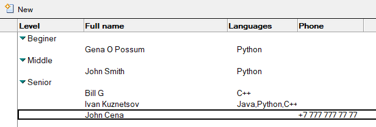

Вернем обратно Junior и заодно актуализируем остальные справочники:
```
doc.replace_item_value("Level", "Junior")
doc.save()

ext_col = ExtendedCollection()
ext_col.append(db.get_view("Levels"))

view = db.get_view("Languages")
ext_col.append(view)

for doc in ext_col:
    agent.run(doc)
```

#### ACL
Получим ACL базы, посмотрим какие в нем есть роли, добавим новую роль TEST:
```
from notescompy import init_session, open_database
from notescompy.acl import UserType, ACLRights, ACLLevel

s = init_session("python")
db = open_database('PyLN', 'itcrowd.nsf')
acl = db.acl
print(acl.roles)
acl.AddRole("TEST")
acl.Save()
print(acl.roles)
```
> ('[HR]', '[Admin]')

> ('[HR]', '[Admin]', '[TEST]')

Проитерируемся по всем записям (как всегда поддерживается и LS-стиль):
```
for entry in acl:
    print(entry)
```

> Name: -Default-, User type: Unspecified, Level: No access, Roles: -, Rights: ()

> Name: CN=PyLN/O=PyLN, User type: Server, Level: Manager, Roles: -, Rights: (Create documents, Create LotusScript/Java agents, Create private agents, Create personal folders/views, Create shares folders/views, Delete documents, Replicate or copy documents, Read public documents, Write public documents)

> Name: CN=Python/O=PyLN, User type: Person, Level: Manager, Roles: ([HR], [Admin]), Rights: (Create documents, Create LotusScript/Java agents, Create private agents, Create personal folders/views, Create shares folders/views, Delete documents, Replicate or copy documents, Read public documents, Write public documents)

> Name: OtherDomainServers, User type: Server group, Level: No access, Roles: -, Rights: ()

> Name: LocalDomainServers, User type: Server group, Level: Manager, Roles: -, Rights: (Create documents, Create LotusScript/Java agents, Create private agents, Create personal folders/views, Create shares folders/views, Delete documents, Replicate or copy documents, Read public documents, Write public documents)

Добавим в ACL нового пользователя Test c уровнем редактора и правами на репликацию и удаление:
```
entry = acl.create_acl_entry("Test")
entry.user_type = UserType.PERSON
entry.level = ACLLevel.EDITOR
rights = ACLRights()
rights.can_replicate_or_copy_documents = True
rights.can_delete_documents = True
entry.rights = rights
acl.save()
```
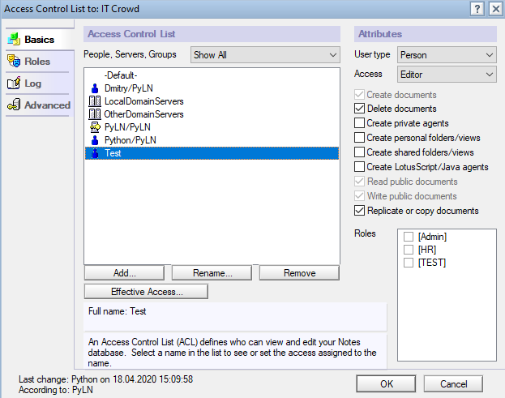

Для установки прав мы воспользовались вспомогательным классом ACLRights. Добавим в ACL группу разаработчиков со всеми ролями и посмотрим как можно в одну строчку установить необходимые права:
```
entry = acl.CreateACLEntry("Devs")
entry.user_type = UserType.PERSON_GROUP
entry.level = ACLLevel.DESIGNER
entry.roles = acl.roles
entry.rights = ACLRights(can_create_ls_or_java_agent=True, can_replicate_or_copy_documents=True)
acl.save()
```
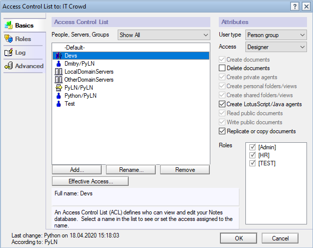


Под конец удалим пользователя Test, роль TEST переименуем, а пользователю Python добавим роль BOSS:
```
acl.remove_acl_entry("Test")
acl.rename_role("TEST", "BOSS")
entry = acl.get_entry("Python/PyLN")
roles = entry.roles
roles.append("BOSS")
entry.roles = roles
acl.save()
```
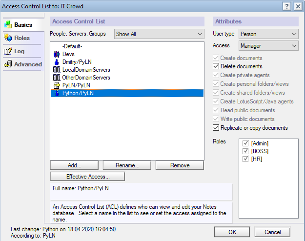


#### Логирование
Поддерживается логирование в базу логов и в файл. Дополнительно реализованы уровни логирования DEBUG, INFO, ERROR.
Для логирования в базу необходимо получить базу и проинициализировать логер:
```
from notescompy import init_session, open_database, log

s = init_session("python")

logdb = open_database('PyLN', 'dblog.nsf')
l = log.notes_log(logdb, "Python log", log.LogLevel.DEBUG)

l.debug("Start")
l.info("Something important")
l.error("Scary error")

try:
    logdb.acl.delete_role("ROLE")
except Exception as e:
    l.error(f"Cant delete role: {e}", 5001)

l.info("Done")
l.debug("End")
```
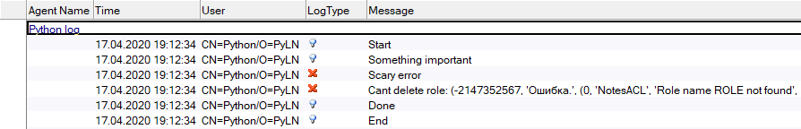
Для логирования в файл меняется инициализация:
```
l = log.file_log("log.log", "Python log", log.LogLevel.INFO)
```
> Python log: 17.04.2020 19:20:47: Something important
Python log: 17.04.2020 19:20:47: Error (0): Scary error
Python log: 17.04.2020 19:20:47: Error (5001): Cant delete role: (-2147352567, 'Ошибка.', (0, 'NotesACL', 'Role name ROLE not found', None, 0, -2147217294), None)
Python log: 17.04.2020 19:20:47: Done

#### Импорт в JSON
Классы Document, DocumentCollection, ExtendedCollection, View, ACLEntry, ACL поддерживают методы импорта и сохранения данных в формате JSON - `to_json` и `save_to_json`. Для Document, DocumentCollection, ExtendedCollection, View методы принимают набор полей, свойств и формул, которые необходимо выгрузить в JSON, аналогично методу get_values. ACLEntry и ACL принимают параметр asStr, в зависимоти от которого тип записи и уровень выгружаются как числовые константы или как строковое описание.
Сохраним в файл представление Persons
```
from notescompy import init_session, open_database

s = init_session("python")
db = open_database('PyLN', 'itcrowd.nsf')

view = db.get_view("Persons")

with open("view.json", "w") as f:
    view.save_to_json(f)
```


> view.json:

```
{
    "45A4A1F61B47769443258541003609B3": {
        "Full name": "John Smith",
        "Languages": "Python",
        "Level": "Middle",
        "Phone": ""
    },
    "9A899214038E229843258541003BFFDB": {
        "Full name": "Ivan Kuznetsov",
        "Languages": [
            "Java",
            "Python",
            "C++"
        ],
        "Level": "Senior",
        "Phone": ""
    },
    "A5426F32DBE6B94143258541003C40CE": {
        "Full name": "Gena O Possum",
        "Languages": "Python",
        "Level": "Junior",
        "Phone": ""
    },
    "DFBCDDFEE3D0764C432585410046CFFE": {
        "Full name": "John Cena",
        "Languages": "",
        "Level": "Senior",
        "Phone": "+7 777 777 77 77"
    },
    "F219AA2C843B6DD743258541003C1E99": {
        "Full name": "Bill G",
        "Languages": "C++",
        "Level": "Senior",
        "Phone": ""
    }
}
``` 


Найдем все сотрудников, знающих Python и сохраним их ФИО и уровень:
```
view = db.get_view("srchPersonsByLanguage")
col = view.get_all_documents_by_key("3F1B416909DE674043258541003445AA")
with open("col.json", "w") as f:
    col.save_to_json(f, fields=["FullName", "Level"])
```

> col.json:
```
{
    "45A4A1F61B47769443258541003609B3": {
        "FullName": "John Smith",
        "Level": "Middle"
    },
    "9A899214038E229843258541003BFFDB": {
        "FullName": "Ivan Kuznetsov",
        "Level": "Senior"
    },
    "A5426F32DBE6B94143258541003C40CE": {
        "FullName": "Gena O Possum",
        "Level": "Junior"
    }
}
```

Выгрузим ACL и отправим безопасникам, пусть разбираются почему в базе такие права:
```
acl = db.acl
with open("acl.json", "w") as f:
    acl.save_to_json(f, asStr=True)
```
> acl.json:
```
{
    "-Default-": {
        "Level": "No access",
        "Name": "-Default-",
        "Rights": "[]",
        "Roles": [],
        "UserType": "Unspecified"
    },
    "CN=Dmitry/O=PyLN": {
        "Level": "Manager",
        "Name": "CN=Dmitry/O=PyLN",
        "Rights": "['Create documents', 'Create LotusScript/Java agents', 'Create private agents', 'Create personal folders/views', 'Create shares folders/views', 'Delete documents', 'Replicate or copy documents', 'Read public documents', 'Write public documents']",
        "Roles": [],
        "UserType": "Person"
    },
    "CN=PyLN/O=PyLN": {
        "Level": "Manager",
        "Name": "CN=PyLN/O=PyLN",
        "Rights": "['Create documents', 'Create LotusScript/Java agents', 'Create private agents', 'Create personal folders/views', 'Create shares folders/views', 'Delete documents', 'Replicate or copy documents', 'Read public documents', 'Write public documents']",
        "Roles": [],
        "UserType": "Server"
    },
    "CN=Python/O=PyLN": {
        "Level": "Manager",
        "Name": "CN=Python/O=PyLN",
        "Rights": "['Create documents', 'Create LotusScript/Java agents', 'Create private agents', 'Create personal folders/views', 'Create shares folders/views', 'Delete documents', 'Replicate or copy documents', 'Read public documents', 'Write public documents']",
        "Roles": [
            "[HR]",
            "[Admin]",
            "[BOSS]"
        ],
        "UserType": "Person"
    },
    "Devs": {
        "Level": "Designer",
        "Name": "Devs",
        "Rights": "['Create documents', 'Create LotusScript/Java agents', 'Create private agents', 'Create personal folders/views', 'Create shares folders/views', 'Replicate or copy documents', 'Read public documents', 'Write public documents']",
        "Roles": [
            "[HR]",
            "[Admin]",
            "[BOSS]"
        ],
        "UserType": "Person group"
    },
    "LocalDomainServers": {
        "Level": "Manager",
        "Name": "LocalDomainServers",
        "Rights": "['Create documents', 'Create LotusScript/Java agents', 'Create private agents', 'Create personal folders/views', 'Create shares folders/views', 'Delete documents', 'Replicate or copy documents', 'Read public documents', 'Write public documents']",
        "Roles": [],
        "UserType": "Server group"
    },
    "OtherDomainServers": {
        "Level": "No access",
        "Name": "OtherDomainServers",
        "Rights": "[]",
        "Roles": [],
        "UserType": "Server group"
    }
}
```

#### Скрипт актуализации сотрудников на Python
Напишем на Python функцию, актуализируются сотрудников аналогично агенту. На вход передается измененный документ справочника, по представлению ищутся сотрудники, у которых указано значение измененного справочника, значение актуализируется

Lotus Script:
```
Sub Initialize
	Dim doc As NotesDocument
	Dim agent As NotesAgent
	Dim s As New NotesSession
	Dim db As NotesDatabase
	Dim view As NotesView
	Dim col As NotesDocumentCollection
	Dim unid  As String
	Dim personDoc As NotesDocument
	Dim fieldName, feldUNIDName As String
	Dim fieldValue, fieldUNIDValue As Variant
	Dim i As Integer
	Dim newValue As String
	
	Set agent = s.Currentagent
	Set db = agent.Parent
		
	Set doc = db.Getdocumentbyid(agent.Parameterdocid)
	unid = doc.Getitemvalue("UNID")(0)
	
	If doc.Getitemvalue("Form")(0) = "Language" Then
		Set view = db.Getview("srchPersonsByLanguage")
		fieldName = "Languages"
		feldUNIDName = "LanguagesUNID"
		newValue = doc.Getitemvalue("Name")(0)
	ElseIf doc.Getitemvalue("Form")(0) = "Level" Then
		Set view = db.Getview("srchPersonsByLevel")
		fieldName = "Level"
		feldUNIDName = "LevelUNID"
		newValue = doc.Getitemvalue("Level")(0)
	Else
		Exit sub
	End If	
	
	Set col = view.Getalldocumentsbykey(unid)
	Set personDoc = col.Getfirstdocument()
	While Not personDoc Is Nothing
		fieldValue = personDoc.Getitemvalue(fieldName)
		fieldUNIDValue = personDoc.Getitemvalue(feldUNIDName)
		
		For i = 0 To UBound(fieldUNIDValue)
			If fieldUNIDValue(i) = unid Then
				fieldValue(i) = newValue
			End If			
		Next
		
		Call personDoc.Replaceitemvalue(fieldName, fieldValue)
		Call personDoc.Save(True, False)		
		
		Set personDoc = col.Getnextdocument(personDoc)
	Wend
		
End Sub
```

Мы часто храним в поле какие-то значения из справочников или других документов, а в соседнем поле UNIDы этих документов. Например, для сотрудника в поле Languages содержатся значения:
* "Java"
* "Python"
* "C++"

а в поле LanguagesUNID UNIDы соответствующих справочников:
* "8267D1ACBF7A300243258541003552BD"
* "3F1B416909DE674043258541003445AA"
* "51AD377698E6CD2F43258541003550D3"

Для удобного итерирования по таким полям сделан метод `get_values_t` возвращающий кортеж из значений переданных полей. В примере воспользуемся этим методом. Заодно добавим логирование и сохранение всех измененных документов в конце работы

Python:
```
from notescompy import extended_collection, open_database, log


def update_person(doc):
    logdb = open_database('PyLN', 'dblog.nsf')
    l = log.notes_log(logdb, "Python log", log.LogLevel.INFO)

    unid = doc.get_item_value0("unid")

    l.info(f"Актуализация для справочника {unid}")
    db = doc.parent_database
    col = extended_collection.ExtendedCollection()

    if doc.get_item_value0("Form") == "Language":
        view = db.get_view("srchPersonsByLanguage")
        field_name = "Languages"
        field_unid_name = "LanguagesUNID"
        new_value = doc.get_item_value0("Name")
    elif doc.get_item_value0("Form") == "Level":
        view = db.get_view("srchPersonsByLevel")
        field_name = "Level"
        field_unid_name = "LevelUNID"
        new_value = doc.get_item_value0("Level")
    else:
        return

    for person_doc in view.get_all_documents_by_key(unid):
        field_value = []

        for field_v, field_unid in person_doc.get_values_t(field_name, field_unid_name):
            if field_unid == unid:
                field_value.append(new_value)
            else:
                field_value.append(field_v)

        if field_value != person_doc.get_item_value(field_name):
            person_doc.replace_item_value(field_name, field_value)
            col.append(person_doc)

    col.save()

    l.info(f"Изменено {col.count} документов")

```


#### Доступ к нереализованным методам и свойствам
Если необходимо воспользоваться методом или свойством, не реализованным в библиотеке, то можно использовать свойство `notes_property`
Например, получим значение ReplicaID базы:

```
from notescompy import init_session, open_database
s = init_session("python")
db = open_database('PyLN', 'itcrowd.nsf')
print(db.notes_property.ReplicaID)
```
> 432585410032221D


#### Использование из клиента
В клиенте Notes сделаем кнопку, вызывающую python-скрипт, и устанавливающую переменные окружения с текущим документом, сервером и базой
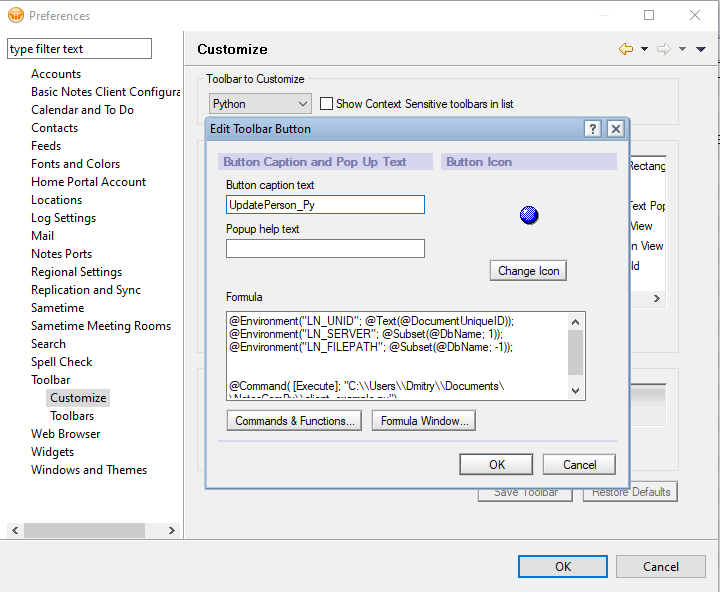

```
@Environment("LN_UNID"; @Text(@DocumentUniqueID));
@Environment("LN_SERVER"; @Subset(@DbName; 1));
@Environment("LN_FILEPATH"; @Subset(@DbName; -1));

@Command( [Execute]; "path\\to\\script\\client_example.py")
```

В скрипте инициализируем сессию текущей сессией клиента, получим переменные окружения и вызовем функцию обновления сотрудников

```
from notescompy import init_current_session, open_database, session, extended_collection, log

def update_person(doc):
    ...


s = init_current_session()
unid = s.notes_property.GetEnvironmentString("LN_UNID")
path = s.notes_property.GetEnvironmentString("LN_FILEPATH")
server = s.notes_property.GetEnvironmentString("LN_SERVER")

db = open_database(server, path)
doc = db.get_document_by_unid(unid)

update_person(doc)

input("Готово")
```


#### Под капотом
Все классы, соответствующие Notes классам являются наследниками класса `NotesHandle`. Класс сохраняет в себе указатель на COM-объект, а также предоставляет доступ к свойствам и методам COM-объектов через точку посредством своего свойста `notes_property`, являющегося экземпляром класса `ProxyProperty`.
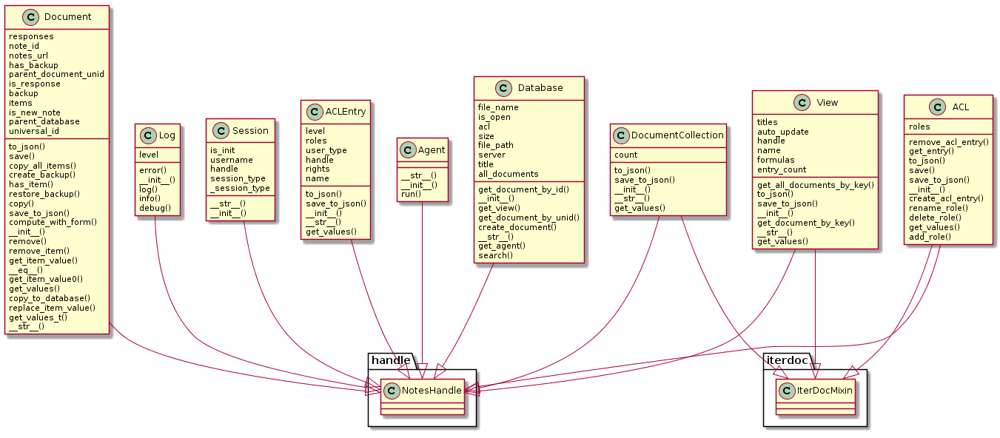
Классы, поддерживающие итерации (`ACL`, `View`, `Collection`) также наследуются от класса `IterDocMixin`. `IterDocMixin` инициализируется функциями для взятия певого и последующего объекта и использует их для получения объектов в методе `__next__`.

`Session` является синглтоном. Объект сессии один раз инициализируется при старте программы и в дальнейшем используется уже инициализированный объект.

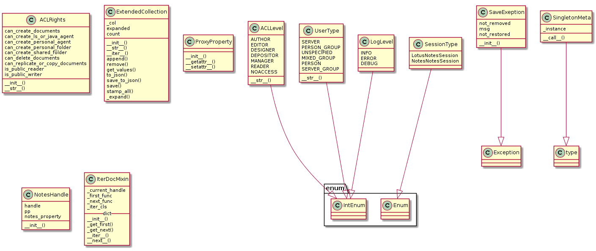
Для константных значений, допустимых при установки определенных свойств реализованы классы-перечисления - `ACLLevel`, `UserType`, `LogLevel`, `SessionType`.

`ACLRights` содержит в себе все возможные права, которые могут быть у записи в ACL.

`ExtendedCollection` реализует коллекцию документов, с дополнительными возможностями добавления документов и транзакционного сохранения. Для расширенной информации об ошибке при сохранении в классе `ExtendedCollection` реализован класс `SaveException`, дополнительно содержащий информацию о документах, которые не удалось восстановить/удалить при откате сохранения.